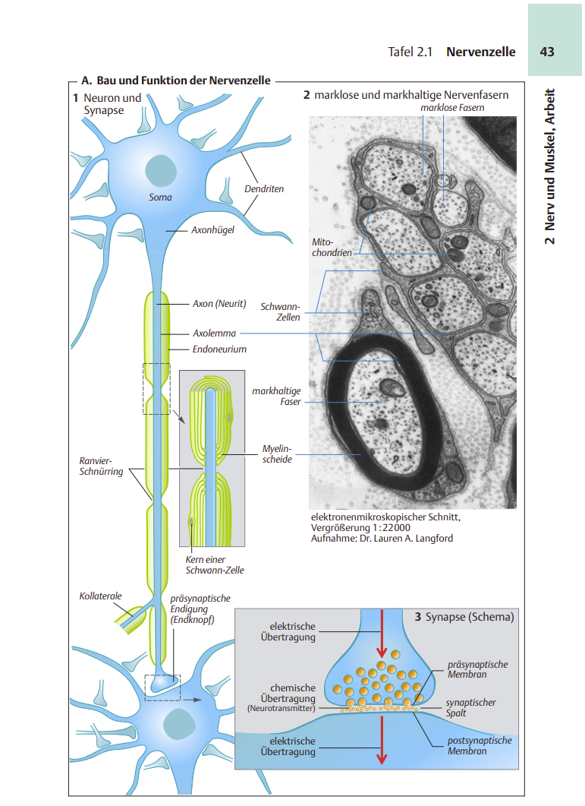
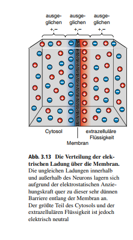

import {R, F, S, EQ} from "../../../src/components/Refs.js";

## 1.1 Einleitung
Um ein Verständnis für das Modell der im weiteren Verlauf dieser Arbeit beschriebenen _künstlichen neuronalen Netze_ zu erlangen, wollen wir uns zunächst mit dem menschlichen Neuron als "strukturelle und funktionelle Einheit des Nervensystems" <R>SD07, S.42</R> beschäftigen. 
Von Interesse ist für uns die Funktionsweise dieser Zellen im Kontext von Informationsverarbeitung und -weiterleitung, weshalb wir die molekulare und die zelluläre Ebene des einzelnen Neurons betrachten wollen, sowie den Verbund von Neuronen, also dem neuronalen Netz <R>Lyr17, S. 2, Abs. 5</R>.

Hierzu skizzieren wir zunächst den Aufbau eines Neurons und verschaffen uns im Anschluss einen Überblick über die komplexen biochemischen Vorgänge, die nötig sind, damit Neuronen Signale senden und empfangen können. Wir werden sehen, dass Änderungen der Zellmembran-Eigenschaften (hier: das _Membranpotenzial_) eines Neurons mitverantwortlich sind für die _Exozytose_<F>1</F> von hemmenden oder erregenden Neurotransmittern in den synaptischen Spalt (s. Abb. X); Rezeptoren postsynaptischer Zellen verarbeiten diese Substanzen dann gemäß ihren _inhibitorischen_<F>2</F> oder _exzitatorischen_<F>3</F> Eigenschaften zu inhibitorischen oder exzitatorischen Signalen.

Da sich diese Arbeit auf die Funktionsweise _künstlicher neuronaler Netze_ konzentriert, verstehen wir im Folgenden unter _neuronales Netz_ ein eben solches. Reden wir von _biologischem neuronalen Netz_, wollen wir darunter ein Netzwerk von Nervenzellen verstehen, in dem ein Informationsaustausch stattfindet - so, wie es im menschlichen Gehirn existiert <R>BCP18, S. 113, Abs. 2</R>.

Wir werden im folgenden öfter von präsynaptisch und postsynaptisch lesen. Im KIOntext der Informationsverarbeitung bedeutet präsynaptisch Ursprung der Informationen, postsynaptisch Ziel der Informationen.

Die Betrachtungen berücksichtigen  ausschlißelich den menschlichen Organismus.
Wir betrachten checmischen Synapsen.

## 1.2 Aufbau

In der folgenden Abbildung haben wir das Neuron in drei Bereiche eingeteilt. Ihre Rolle innerhalb des Neurons ist wie folgt: 1) _Dendrite_<F>4</F> leiten _afferente_<F>5</F> Signale zum 2) _Soma_<F>6</F>, dem Zellkörper, weiter. Unter bestimmten Bedingungen, die in einem späteren Abschnitt erläutert werden, lösen diese Signale ein "feuern" des Neurons aus, und das 3) _Axon_<F>7</F> leitet ein _efferentes_<F>8</F> Nervensignal über _präsynaptische Endigungen_ (_Axonterminale_) an (häufig weit entfernte<F>9</F>) _Effektoren_<F>10</F> wie Muskeln und Drüsen oder nachgeschaltete Neuronen weiter<F>11</F><F>12</F><R>SD07, S. 42, Abs. 2</R>.

<!--  -->

Die eingehende Schnittstelle eines Neurons sind seine **Dendriten**: Baumförmige Fortsätze (einzelne selten länger als 2 mm<F>14.1</F> <R>BCP18, S. 28, Abs. 2</R>, die um das Soma herum gelagert sind. Diese Dendritenbäume <R>BCP18, S .47</R> fungieren _postsynaptisch_ und empfangen afferente Signale<F>13</F> in Form von Neurotransmittern <R>Eil19, S. 61, "Synapsen"</R>. Diese werden von Rezeptoren, die sich an den Enden der Dendriten befinden, aufgenommen. Oft stehen tausende Neuronen in Verbindung mit den Dendriten eines einzelnen Neurons<F>14</F><R>SD07, S .42</R>. 

Die Dendriten leiten Signale weiter an das **Soma** (oder _Perikaryon_ <R>RK18, S. 58, "Aufbau"</R>, den Zellkörper und das Stoffwechselzentrum des Neurons, der eine Größe von ca. 20 μm<F>15</F> <R>BCP18, S. 29</R> besitzt. In der Zelle befindet sich - durch die _Neuronenmembran_<F>15.1</F> von der Umgebung getrennt - _Zytosol_, eine salzige, wässrige Flüssigkeit mit einem hohen Anteil von Kalium <R>BCP18,  S.29, "Das Soma"</R> (s. Tab. 1.1). In dem Zytosol eingebettet sind weitere subzelluläre Strukturen mit eigener Membranbegrenzung, die _Zellorganellen_ <R>SD07 S.8, Abs. 2</R>. Für die nachfolgenden Untersuchungen interessieren uns bei dem Zellkörper aber vor allem die Zellmembran und der _transmembranale Transport_ von Ionen<F>15.2</F> zur Änderung des Membranpotenzials, insbesondere in der Nähe des **Axonhügels**: Dort entspringt das **Axon**, welches in einer "salzigen extrazellulären Flüssigkeit mit hoher Leitfähigkeit" <R>PCB18, S. 61, Abs. 1</R><F>16</F> liegt. Hier entscheidet sich, ob das Neuron Informationen weiterleitet: Die Summation der durch die postsynaptischen Endigungen einhergehenden Signale kann eine Depolarisation<F>17</F> der Membran an dieser Stelle <R>Eil19, S. 61, "Soma"</R> über einen gewissen **Schwellenwert** bewirken, so das ein **Aktionspotenzial**<F>18</F> ausgelöst wird <R>BCP18, p.142 f.</R>. Dadurch wird in den präsynaptischen Endigungen die Exozytose ausgelöst.

## 1.3 Membranpotenziale des Neurons

Ein Neuron weist in Ruhe<F>19</F> eine ungleiche Ionenverteilung zwischen der durch die Zellmembran getrennten intrazellulären Flüssigkeit (_IZF_: Zytosol) und der extrazellulären Flüssigkeit (EZF) auf. In der IZF befinden sich mehr positiv geladene Natrium-Ionen ($Na^+$), und im EZF mehr positiv geladene Kalium- und Calcium-Ionen ($Ka^+$ und $Ca^{2+}$) sowie mehr negativ geladene Chlorid-Ionen ($Cl^-$).

  

| Ion  | Konzentration EZF (mmol/l) | Konzentration IZF (mmol/l) | Verhältnis |
|------|----------------------------|-------------------|------------|
| $K^+$   | 5                          | 100               | 1 : 20     |
| $Na^+$  | 150                        | 15                | 10:1       |
| $Ca^{2+}$ | 2                          | 0,0002            | 10000 : 1  |
| Cl-  | 150                        | 13                | 11,5 : 1   |
**Tabelle 1.1**: Ionenkonzentration eines Neurons in Ruhe (nach <R>BCP18, S.75, Abb.3.15</R>)

  

Das Membranpotenzial des Neurons wird durch die Verteilung von Ionen in der IZF und EZF bestimmt: In der Membran befinden sich **Ionenkanäle**, von denen viele _selektiv permeable_<F>21.1</F> sind, d.h., sie lassen nur bestimmte Ionen durch (_Ionenselektivität_)<F>22</F><R>BCP18, S 66., Abs. 3</R>. Viele dieser Kanäle können über Änderungen in der Umgebung des Neurons geöffnet oder geschlossen werden (**Gating**, <R>KSJ+13, S.108, 2. Abs. rechte Spalte</R>).  
Neben den Ionenkanälen existieren auch **Ionenpumpen** ("**ATPasen**"<F>23</F><R>SD07, S. 26, 2. Abs</R>), die für die Aufrechterhaltung der Ionenverteilung zuständig sind: die $Ca^{2+}$- und $Na^+$-$K^+$-ATPasen sorgen dafür, daß im Neuron laufend  $Ca^{2+}$ und $Na^+$ aus und $K^+$ in die Zelle gepumpt wird <R>SD07, S. 44</R>). Zusammen mit den selektiv permeablen Ionenkanälen entstehen so die Ionenkonzentrationen in **Tabelle 1.1**.

Wenn auf das Neuron kein _postsynaptisches Potenzial_ (**PSP**) wirkt und das Neuron kein Impuls abgibt, liegt das Ruhepotenzial $V_r$ der Zelle zwischen -70 mV und -90 mV <R>SD07,  S. 47, Tafel 2.3 A.1</R><F>20</F>: Das Zytosol weist entlang der Membranoberfläche im IZF eine negative Ladung auf <R>BCP18, S.61, Abs.3</R><F>20.1</F>. Diese _Membranspannung_ $V_m$ wird durch eine ungleiche Ionenverteilung bewirkt <R>FE19, S.66, "Diffusionspotenzial – elektrische Spannung über der Zellmembran"</R>), verursacht durch die Ladung der Teilchen im IZF und EZF in Membrannähe<F>19.1</F>:

> "Die negativen Ladungen im Inneren des Neurons und die positiven Ladungen außerhalb des Neurons ziehen sich in Richtung Zellmembran gegenseitig an, [...] Dementsprechend ist die negative Nettoladung im Inneren der Zelle nicht gleichmäßig im Cytosol verteilt, sondern an der Innenseite der Membran lokalisiert." <R>BCP18, S. 72, Punkt 2</R>

<!---->

**Abbildung 1.2**: Die Verteilung von Ionen im Zytosol und der EZF. Aufgrund der elektrostatischen Anziehungskraft ziehen sich Anionen und Kationen<F>23.1</F> in der Nähe der Membran gegenseitig an, es kommt zu einer negativen Spannung in Membrannähe (zwischen -70 mV -90 mV in Ruhe).

In Ruhe ist die Leitfähigkeit der Membran für $Na^+$ gering, für $K^+$ hingegen hoch <R>SD07 S.44 f.</R>. $K^+$-Ionen folgen ihrem Konzentrationsgradienten<F>19.2</F> und gelangen über die Ionenkanäle in den EZF, bis die Potenzialdifferenz entlang der Neuronenmembran ausströmende $K^+$-Ionen zurückhält: Wenn diese Differenz den Konzentrationsgradienten für $K^+$ kompensiert, erhält man das **Gleichgewichtspotenzial**<F>19.3</F><R>BCP18, S.72 f.</R>, <R>SD07, S. 44 f.</R>. Das Wert des Membranpotenzial nähert sich dem Wert des Gleichgewichtspotenzial desjenigen Ions an, für den die Membran besonders permeabel ist <R>KSJ+13, S. 145, Ende</R> **(S1.1)**. 
Das Gleichgewichtspotenzial lässt sich das für individuelle Ionen mit der Nernst-Gleichung<F>24</F> ermitteln <R>BLS19, S. 67, "Nernst-Gleichung"</R>:

<R>BCP18, S. 74, Exkurs 3.2</R> definiert:

<EQ>

 $E_{Ion} = 2,303  * \begin{matrix} RT \\ \hline zF \end{matrix} * log_{10} * \begin{matrix} [Ion]_{EZF} \\ \hline [Ion]_{IZF} \end{matrix}$

</EQ>

Wobei:

| Variable / Konstante       | Bedeutung                                                                                  |
|-----------|--------------------------------------------------------------------------------------------|
| $E_{ion}$<F>25</F>          | Gleichgewichtspotenzial für das jeweilige Ion                                              | 
| $R$  | Gaskonstante                                                                               | 
| $T$ | absolute Temperatur                                                                        | 
| $z$       | Ladungszahl des Ions                                                                       | 
| $F$       | Faraday-Konstante (elektrische Ladung eines Mols einfach geladener Ionen<F>24.1</F>) | 
| $[Ion]_{EZF}$       | Ionenkonzentration außerhalb der Zelle                                                     |
| $[Ion]_{IZF}$       | Ionenkonzentration innerhalb der Zelle                                                     |

  

Für eine Körpertemperatur von 37° lässt sich die Nernst-Gleichung für das Gleichgewichtspotenzial $E_K$ wie folgt vereinfachen:
<EQ>

 $E_{K} = 61,54 mV  * log_{10} \begin{matrix} [K^+]_{EZF} \\ \hline [K^+]_{IZF} \end{matrix}$

</EQ>

Mit den Werten aus Tabelle 1.1 ergibt sich somit

<EQ>

 $E_{K} = 61,54 mV  * log_{10} \begin{matrix} 1 \\ \hline 20 \end{matrix} = -80 mV$

</EQ>

Wie wir oben gesehen haben, liegt $V_r$ zwischen -70 mV und - 90mV. Wie können wir jetzt auf **(S1.1)** schließen, also dass das Ruhepotenzial durch die Membranpermeabilität von $K^+$ bestimmt wird, wenn $V_r = -70 mV$, aber $E_K = -80 mV$, und die Membran auch noch für andere Ionen wie bspw. $Na^+$ selektiv permeabel ist (<R>BCP18, S. 77 f.</R> sowie <R>SD07S. 44 "Warum ist $E_m$ weniger negativ als $E_K$?"</R>)? Wäre die Membran nur für $K^+$ permeable, so läge $V_r$ sicher bei $E_k$ (vgl. <R>SD07</R> S.32 Abs. 4). 
Ionenkanäle unterstützen einen _passiven Transport_ der Ionen zwischen EZF und IZF _entlang_ ihres Konzentrationsgefälles <R>BLS19, S.30, "Aktive und passive Transportmechanismen"</R>, während Ionenpumpen, die _entgegen_ des Konzentrationsgefälles arbeiten, _aktiv transportieren_<F>26</F>. Ionenpumpen sind für die Ionenkonzentrationsgradienten und deren Aufrechterhaltung verantwortlich <R>BCP18, S.76 f.</R><F>27</F>.
Um $V_r$ zu berechnen müssen die Ionen mitberücksichtigt werden, für die die Membran durchlässig ist. Dies erfolgt durch die **Goldman-Gleichung** <F>28</F>, die zusätzlich für die Berechnung des Membranpotenzials $V_m$  die Permeabilität der Membran für einzelne Ionen berücksichtigt <F>29</F>:

<EQ>

$V_{r} = \begin{matrix} RT \\ \hline F \end{matrix} * ln \begin{matrix}
   P_{Na} \space * \space [Na^+]_{EZF} \space + \space P_{K} \space * \space [K^+]_{EZF} \space + \space P_{Cl} \space * \space [Cl^-]_{IZF}  \\ \hline
   P_{Na} \space * [Na^+]_{IZF} \space + \space P_{K} \space * \space [K^+]_{IZF} \space + \space P_{Cl} \space * \space [Cl^-]_{EZF}
\end{matrix}$

</EQ>

&nbsp;<R>KSJ+13</R> stellt hierzu fest, daß eine hohe Konzentration eines einzelnen Ions zusammen mit einer hohen Membranpermeabilität für dieses Ion auch einen größeren
Beitrag für $V_r$ leistet <R>KSJ+13, S. 135, "Goldman Equation"</R>, weshalb man folgern darf:

> "[...] when permeability to one ion is exceptionally high, the Goldman equation reduces to the Nernst equation for that ion." <R>KSJ+13, S. 135, "Goldman Equation"</R>.

&nbsp;<R>BLS19</R> weist darauf hin,

> "dass die Permeabilitäten in komplizierter Weise von der Membranspannung und den Ionenkonzentrationen [...] abhängen und sich meist nur näherungsweise bestimmen lassen." <R>BLS19, S.67, Goldman Gleichung</R>.

    

--------------

&nbsp;<S>1</S> _Exozytose_ beschreibt den Vorgang, bei dem zellinnere Substanzen nach Außen weitergegeben werden. Wir kommen im Abschnitt über  synaptische Übertragung darauf zurück.

&nbsp;<S>2</S> "_inhibere_" (lat.): anhalten

&nbsp;<S>3</S> "_excitare_" (lat.): erregen, anregen

&nbsp;<S>4</S> "_δένδρον (dendrón)_": (altgriechisch): Baum

&nbsp;<S>5</S> "_afferre_" (lat.): herbeibringen, melden, bringen

&nbsp;<S>6</S> "_σῶμα (sõma)_" (altgriechisch): Körper

&nbsp;<S>7</S> "_axon_" (lat.): Achse

&nbsp;<S>8</S> "_efferre_" (lat.): hinaustragen, mitnehmen

&nbsp;<S>9</S> Axone können sich im menschlichen Körper über Entfernungen von bis zu über 1m ausstrecken (vgl. <R>BCP18</R>, S. 28, Abs. 2)

&nbsp;<S>10</S> "_efficere_" (lat.): bewirken, hervorbringen

&nbsp;<S>11</S> in diesem Fall empfangen _postsynaptische Rezeptoren_ an den Dendriten des nachgeschalteten Neurons ein Signal und der beschriebene Prozess wiederholt sich. 

&nbsp;<S>12</S> etwas bildlicher können wir uns Effektoren als Endglied der Signalübertragung vorstellen, auch wenn hier wieder interzelluläre Vorgänge stattfinden. Vgl. "neuromuskuläre Endplatte" [BCP18, S. 127, Abs. 3] 

&nbsp;<S>13</S> aufgrund der signalempfangenden Eigenschaften und der dünnen Spitzen der Dendriten liegt der Vergleich mit "Antennen" nahe (vgl. <R>BCP18</R>, S. 28, Abs. 2)

&nbsp;<S>14</S> das menschliche Gehirn besitzt mindestens $10^11$ Neuronen (vgl. <R>KSJ+13</R>, S. 175, Abs. 2)

&nbsp;<S>14.1</S> [Eil19, S. 58, "Polarisierung"] nennt für die "Dendritenlänge kortikaler Pyramidenzellen" eine Länge von 1 cm 

&nbsp;<S>15</S> ein menschliches Haar hat einen Durchmesser von ca. 70 μm, kleine Bakterien bis zu 20 μm [WEmb] 

&nbsp;<S>15.1</S> Membrandicke ca. 5 nm (<R>BLS19</R>, Seite 66, letzter Absatz linke Spalte) 

&nbsp;<S>15.2</S> hier: der Austausch von Ionen zwischen dem intra- und extrazellulären Raum durch Kanäle und Pumpen. Als **Ion** bezeichnet man ein elektrisch geladenes Atom oder Molekül.

&nbsp;16 <R>BCP18</R>, S. 43, Abs. 1, führt das Axon metaphorisch mit einer Telefonleitung zusammen

&nbsp;<S>17</S> Depolarisation bezeichnet die Verringerung des Membranpotenzials  (vgl. <R>RHN+16</R>, S. 812 "Neurotransmitter und ihre Rezeptoren"), bspw. von einem negativen Wert auf einen weniger negativen oder gar einen positiven Wert

&nbsp;<S>18</S> der formale Begriff für das Signal, das zu den Axonterminalen gesendet wird 

&nbsp;<S>19</S> vgl. **Mempranpotenzial**: "die Spannung an der Nervenzellmembran zu einem beliebigen Zeitpunkt" [BCP18, S.70, "Ionen als Grundlage des Ruhepotenzials"]; **Ruhepotenzial**: "the electrical potential across the membrane in the absence of signaling" [KSJ+13, S. 126] 

&nbsp;<S>19.2</S> unter der Diffusion ("_diffundere_" (lat.): zerstreuen, ausbreiten) von Molekülen versteht man den Prozess, wenn Moleküle entlang eines Konzentrationsgradienten (auch: Konzentrationsgefälles) ein Ausgleich der Konzentrationsunterschiede anstreben. Moleküle in hoher Konzentration diffundieren dann in die Bereiche mit niedriger Konzentration: In den hier betrachteten Beispielen diffundieren bspw. $K^+$-Ionen, bis das Gleichgewichtspotenzial erreicht ist

&nbsp;<S>19.3</S> "the equilibrium potential of any ion that is present on both sides of a membrane permeable to that ion " (<R>KSJ+13</R>, S.130, letzter Abs., linke Spalte) 

&nbsp;<S>20</S> [BCP18, S.70, "Ionen als Grundlage des Ruhepotenzials"] gibt -65 mV an (1 mV = 0,001 V). Die Autoren gehen hierbei von einer 40-mal so hohen Ionenpermeabilität für $K^+$ gegenüber $Na^+$ aus berücksichtigen Cl- nicht in der Goldman-Gleichung (vgl. <R>BCP18</R>, S. 74, Exkurs 3.2). 

&nbsp;<S>20.1</S>Das Membranpotenzial $V_m$ ergibt sich als die Differenz der Spannungen $V_{IZF}$ und $V_ezf$, wobei $V_{IZF}$ die Spannung im IZF und $V_
{EZF}$ die Spannung im EZF ist. $V_r$ ist dann gleich zu $V_{IZF}$, da nach Konvention&nbsp;<S>21</S> die Spannung im EZF als $0$ definiert ist (vgl. <R>KSJ+13</R> S. 127, rechte Spalte, 2. Abs.).

&nbsp;<S>21</S> vorausgesetzt, die Zelle ist in Ruhe 

&nbsp;<S>21.1</S> "_permeare_" (lat.) durchwandern 

&nbsp;<S>22</S> Kaliumkanäle sind durchlässig für $K^+$ Ionen, Natriumkanäle durchlässig für $Na^+$ Ionen usw. 

&nbsp;<S>23</S> Adenosintriphosphasen - Enzyme, die ATP in ADP und Phosphat aufspalten [QUELLE] 

&nbsp;<S>23.1</S>Anion: negativ geladenes Ion; Kation: positiv geladenes Ion  

&nbsp;<S>24</S> Walther Nernst (1864 - 1941), dt. Physiker und Chemiker, gehört zu den Begründern der physikalischen Chemie [Wern] 

&nbsp;<S>24.1</S>  1 Mol = $6.02214076e10^{23}$ Teilchen

&nbsp;<S>25</S> $E$ steht für _Equilibrium_: "Gleichgewicht" (lat. aequus "gleich", libra lat. "Waage/Gewicht")

&nbsp;<S>26</S> hierfür wird metabolische Energie verbraucht (vgl <R>BLS19</R>, S. 31, "Primär aktiver Transport")

&nbsp;<S>27</S> es wird ein nicht unwesentlicher Teil von Energie zur Aufrechterhaltung dieser Gradienten verbraucht. Die Natrium-Kalium-Pumpe verbraucht laut <R>BCP18</R>, S. 76, 1. Abs., etwa 70 % der ATP-Menge (siehe auch &nbsp;<S>23</S>), die das Gehirn benötigt.

&nbsp;<S>28</S> auch: **Goldman-Hodgkin-Katz-Gleichung** (GHK-Gleichung) nach David Eliot Goldman (1910–1998), Alan Lloyd Hodgkin(1914 - 1998) und Bernard Katz (1911 - 2003). Hodgkin erhielt 1963 zusammen mit Andrew Fielding Huxley (1917 - 2012) und John Carew Eccles (1903–1997) den Medizin-Nobelpreis für ihre Erforschungen der Ionen-Mechanismen, die bei der Erregung und Hemmung von Nervenzellmembranen beteiligt sind <R>DMW63</R>

&nbsp;<S>29</S> <R>SD07</R> nutzt für die Bestimmung von $V_m$ die fraktionelle Leitfähgkeit der involvierten Ionen und rechnet $V_r = E_K * f_K + E_{Na} * f_{Na} + E_{Cl} * f_{Cl}$ (vgl. <R>SD07</R> S. 32 Gl. 1.21)t